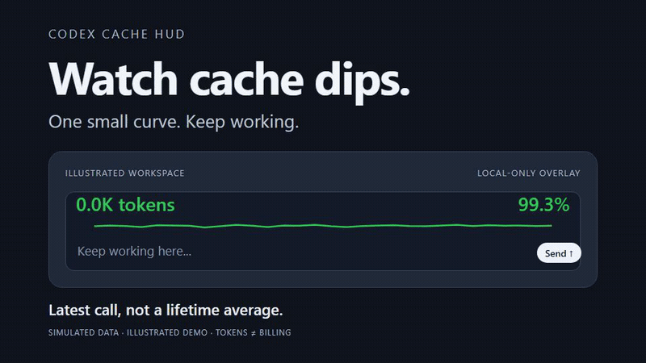

# Codex Cache HUD

A small, local-only Windows overlay for Codex cache-hit activity. Modified from [LH-03/codex-monitor-hud](https://github.com/LH-03/codex-monitor-hud), upstream commit `ace7a89bdb2692eec4f974ef8323865c22a4e68c` (v3.1.0), under the MIT license. This community tool is not affiliated with or endorsed by OpenAI.

[Download for Windows](https://github.com/cheems49cc-dotcom/codex-cache-hud/releases/latest) · [中文说明](README.zh-CN.md) · [Report a bug](https://github.com/cheems49cc-dotcom/codex-cache-hud/issues) · [Privacy](PRIVACY.md) · [License](LICENSE)

## Cache dips, at a glance



*8-second illustrated demo made with Remotion, using synthetic data only—not a desktop recording or billing report. [MP4 version](docs/media/cache-hud-demo.mp4).*

For Windows Codex users who want to keep working while watching cache-hit changes—not keep another dashboard open. Place a small transparent curve near your input area: the chart lets clicks through, and controls appear when you hover over its top strip.

- **One curve, not a wall of metrics:** the latest 30 observed main/subagent calls, with a latest-call percentage rather than a lifetime average.
- **Small enough to stay out of the way:** 20% and 40% size presets, transparent background, and color thresholds that make cache dips visible.
- **Local-only:** no API key, account sign-in, telemetry, or Codex configuration changes.

Prefer detailed per-task lists and separate task bubbles? The [upstream Codex Monitor HUD](https://github.com/LH-03/codex-monitor-hud) may fit better. This derivative focuses on the single-curve workflow; it is not a billing tool or a way to increase your cache hit rate. Controls and tooltips currently use Chinese; English documentation is included.

If this fits your workflow, a **GitHub Star** helps others discover it. Tried it? Share what worked—or a reproducible bug—in [Issues](https://github.com/cheems49cc-dotcom/codex-cache-hud/issues). Please do not attach raw session logs, credentials, or private screenshots.

## Download and run

Download the Windows x64 ZIP from [the latest release](https://github.com/cheems49cc-dotcom/codex-cache-hud/releases/latest), extract the whole folder, and open `CodexCacheHUD.exe`. Keep the files together. Windows 10/11 x64 is supported; the self-contained build does not need a separate .NET runtime. A local Codex session directory is required. The binary is currently unsigned.

No API key, account sign-in, installer, administrator access, startup task, or Codex configuration change is required. Exit from the system tray. Do not disable antivirus protections if a download is flagged; report the detection name and release hash instead.

## What the numbers mean

- **Left — context growth since launch:** each observed session starts with a baseline; positive changes in its latest `last_token_usage.total_tokens` are added. Newly created sessions start from zero. Compaction does not subtract prior growth. Closing and reopening the HUD resets this in-memory counter. This measures observed context growth, **not billed tokens, API cost, or subscription usage**.
- **Right — latest call cache hit:** `cached_input_tokens / input_tokens` for the last chart point. No lifetime averaging.
- **Curve:** the most recent 30 real calls across discovered main and subagent sessions. Points are equally spaced by call order, not elapsed time. No synthetic calls are added to make the chart move.
- **Idle, paused, or waiting for a new turn's first result:** the percentage reads `--`; history remains dimmed. Hover over the percentage to see status and the latest call time.
- **Colors:** at least 98% green; 95–98% yellow; 90–95% red; below 90% dark red. The number and curve use the same latest-call color.

The overlay follows records written locally by Codex; it cannot show an inference's final token counts before Codex emits them. Logs are not a billing ledger. Discovery is bounded (30-minute recent window by default); missing, locked, unsupported, or delayed local records can limit coverage. Quota percentages in the diagnostic tooltip are locally observed snapshots, not a live account query.

## Controls

- Size: 20%, 40%, 60%, 78%, or 100%.
- Background: fully transparent, or 20–100% visibility without fading the text.
- In fully transparent mode only the top text-height strip accepts the mouse and reveals the controls; the chart area lets clicks through to the app beneath it.
- The left value displays only a compact number and `tokens` (for example, `123K tokens`). Hover for the context-growth formula and token breakdown; explanatory controls and tooltips currently use Chinese.
- Right-click or use the tray for pause, settings, and exit. Settings belong to the HUD only, in `%LOCALAPPDATA%\CodexMonitorHUD`.

## Build and verify

Install an official .NET 10 SDK compatible with `global.json`, then run from the repository root on Windows:

```powershell
dotnet run --project tests-dotnet/CodexMonitorHud.Core.Tests -c Release
dotnet run --project tests-dotnet/CodexMonitorHud.App.Tests -c Release
pwsh -File scripts/Publish-Windows.ps1
```

The Core checks use synthetic temporary sessions. The WPF checks exercise the real view without opening a window or reading your Codex sessions. The publishing script emits a portable ZIP and SHA-256 checksum under `artifacts/`. It excludes debug symbols, user settings, session files, and local SDKs. Builds map source paths to `/_/`.

## Attribution and scope

The upstream project supplies the WPF/Core foundation. This derivative focuses on the single cache curve, transparent compact controls, launch-scoped growth, main/subagent call history, and lifecycle-aware status. Original copyright and permission notices remain in [LICENSE](LICENSE); palette references remain in [COLOR_ATTRIBUTION.md](COLOR_ATTRIBUTION.md). Legacy plugin/MCP installation scripts, screenshots, and private development history are not distributed in this repository.

See [CONTRIBUTING.md](CONTRIBUTING.md) for development and [SECURITY.md](SECURITY.md) for safe issue reporting.
